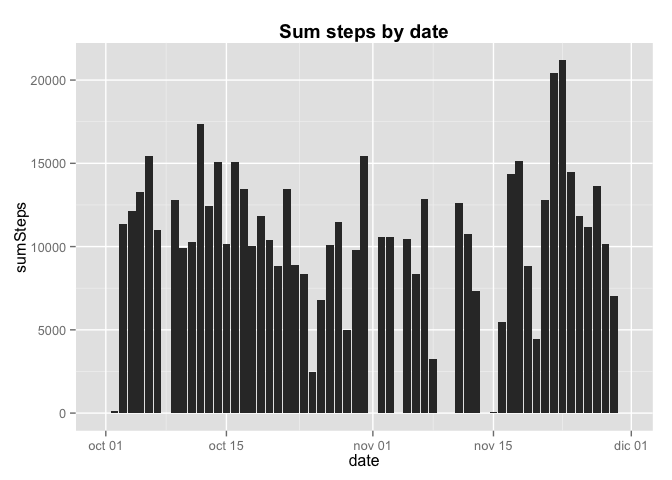

# Reproducible Research: Peer Assessment 1
## Needed libraries

```r
    library(plyr)
    library(ggplot2)
    library("reshape2")
```

```
## Warning: package 'reshape2' was built under R version 3.1.2
```
## Loading and preprocessing the data

```r
      unzip("activity.zip")
      data<-read.csv("activity.csv",sep = ",")
      data$date <- as.Date(data$date, "%Y-%m-%d")
```

## What is mean total number of steps taken per day?`
### Calculate the total number of steps taken by day

```r
      stepSumByDate <- ddply(data, .(date), summarise, sumSteps = sum(steps, na.rm = TRUE))
      ggplot(stepSumByDate, aes(date, sumSteps))+ ggtitle("Sum steps by date")+theme(plot.title = element_text(face="bold"))+geom_histogram(stat = "identity")
```

 

## What is the average daily activity pattern?


```r
      totalStepMean <- mean(stepSumByDate$sumSteps,na.rm = TRUE)

      totalStepMedian <- median(stepSumByDate$sumSteps,na.rm = TRUE)
```

## Imputing missing values


## Are there differences in activity patterns between weekdays and weekends?
